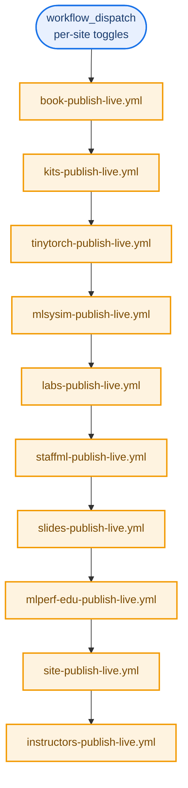

# CI Workflows: what actually runs and when

*This document inventories every GitHub Actions workflow in `harvard-edge/cs249r_book`, 66 files as of this writing, and explains the pattern they follow, what each one actually does, and the real quirks discovered by tracing several of them by hand rather than trusting their header comments alone. If you are trying to figure out why a badge is red, why a PR's checks never ran, or which workflow actually deploys a given site, start here. Read [`ecosystem-map.md`](ecosystem-map.md) first for how the projects relate to each other; this document is specifically about the automation that builds, tests, and ships them.*

## 1. The pattern almost every project follows

Ten of the eleven sub-projects (all except design-grammar and socratiq, see section 5) follow the same three-workflow shape, plus a fourth reusable one for anything that produces a PDF:

```
<project>-validate-dev.yml   tests, builds, lints. The thing that has to be green.
        |
        v
<project>-preview-dev.yml    deploys the validated build to a staging site.
        |
        v (manual only, requires typing a confirmation string)
<project>-publish-live.yml   deploys to mlsysbook.ai, the real production site.

<project>-build-pdfs.yml     reusable, called by preview and publish when a
                              project ships a downloadable PDF (guide, paper,
                              slide decks). Never runs standalone in the deploy path.
```

`validate-dev.yml` almost always declares three trigger types at once: `push` to `dev` (so the README badge reflects the branch's real state), `pull_request` (so a contributor's PR gets checked before merge), and `workflow_call` (so `preview-dev.yml` can invoke it directly as a job and gate deployment on it passing). This triple-trigger design is deliberate and documented consistently across the repo: it closes the exact race window where a preview could deploy on a commit its own validation had already failed on, and it means the same validate workflow that gates a PR is the one whose green run the badge actually reflects.

`publish-live.yml` is `workflow_dispatch`-only across every project, no automatic trigger ever ships to production. Most require typing a literal confirmation string as an input before the job proceeds.

## 2. The orchestrator: `publish-all-live.yml`



`publish-all-live.yml` holds no build logic of its own. Every step is a `uses:` call to that project's own standalone publish workflow, in the fixed order shown above, each waiting for the previous one to finish. This is a deliberate choice, not an oversight: the comment in the file states plainly that a project-specific `uses:` call can never drift out of sync with what running that project's publish workflow directly would do, since there is only one implementation, not a duplicated copy inside the orchestrator. Two defaults worth knowing: `deploy_book` defaults to `false` (the book release is heavier, opted in explicitly) and `site_only` defaults to `true` (most "publish all" runs are content refreshes, not full version-bumping releases).

The orchestrator also deliberately carries no workflow-level concurrency lock. Each child workflow declares its own `gh-pages-deploy` lock on its own deploy job. A lock at the orchestrator level would deadlock against its own children: the parent holds the lock, a child waits on it, the parent waits on the child, forever.

## 3. Per-project workflows

### Book (`book/`)

| Workflow | Trigger | What it does |
|---|---|---|
| `book-validate-dev.yml` | push to dev, PR, dispatch | Pre-commit hooks, then a full container-based build matrix (see below). |
| `book-build-container.yml` | `workflow_call`, dispatch | Reusable matrix build: up to 12 parallel jobs (2 volumes x 3 formats x 2 OS) using pre-built Docker containers so contributors and CI never pay the 30 to 45 minute native dependency-install cost. |
| `book-preview-dev.yml` | `workflow_run` after Validate succeeds, dispatch | Downloads the validated artifacts, assembles the staging site, deploys via SSH. |
| `book-publish-live.yml` | dispatch only, requires "PUBLISH" | Merges dev into main, rebuilds via the container matrix, deploys to `gh-pages`, tags a release, generates AI-assisted release notes, reverts the merge automatically on failure or timeout. |

design-grammar is referenced inside `book-validate-dev.yml` rather than having any workflow file of its own, see section 5.

### Kits (`kits/`)

`kits-validate-dev.yml` (image-reference checks, Quarto build, PDF compile via the reusable `kits-build-pdfs.yml`), `kits-preview-dev.yml`, `kits-publish-live.yml`. Standard triad plus one reusable PDF builder.

### TinyTorch (`tinytorch/`)

| Workflow | What it does |
|---|---|
| `tinytorch-validate-dev.yml` | A 7-stage progressive suite: inline build from `src/`, unit tests, integration tests, CLI tests (three of these run in parallel), then end-to-end tests gated on all three, then a Docker-based fresh-install simulation, then a destructive full user-journey test reserved for explicit `all`/`user-journey` runs. Matrixed across Ubuntu and Windows (Windows runs everything through Git Bash for cross-platform shell compatibility). |
| `tinytorch-build-pdfs.yml` | Reusable: builds the Lab Guide (Quarto to XeLaTeX, reusing the same `.qmd` chapter sources the website uses) and the Research Paper (LuaLaTeX) independently. |
| `tinytorch-preview-dev.yml` | Gated on Validate succeeding via `workflow_run`, deploys the guide, paper, and slide downloads to staging. |
| `tinytorch-publish-live.yml` | Full semantic-versioning release: computes the next version from `tinytorch-v*` tags, runs the full validate suite as a preflight, bumps the version across six files, merges dev into main, builds PDFs, deploys, tags, drafts a GitHub Release. Supports a `site_only` mode that skips version bump, tag, and PDFs entirely for a pure content refresh. |
| `tinytorch-update-pdfs.yml` | Rebuilds and redeploys just the PDFs, no site rebuild, no version bump, for when only PDF content changed. |

### MLSys·im (`mlsysim/`)

Standard triad (`mlsysim-validate-dev.yml` runs pytest plus a docs-site build; `mlsysim-preview-dev.yml`; `mlsysim-publish-live.yml`) plus two extras genuinely worth knowing about:

- **`mlsysim-pypi-publish.yml`**: triggered by pushing a `mlsysim-v*` tag, not by anything in the publish-live chain. Runs the full pytest suite across Python 3.10 through 3.13 in parallel, builds a wheel and sdist, publishes to PyPI via Trusted Publishing (OIDC, no stored PyPI token anywhere in the repo), then does a genuine post-publish smoke test: installs the just-published package from real PyPI (with retry for CDN propagation delay), imports it, and runs a CLI smoke check, before creating the GitHub Release and dispatching `mlsysim-publish-live.yml` to refresh the docs site. This is the only publish pipeline in the whole repo that verifies its own artifact after shipping it, rather than trusting the build step succeeded.
- **`mlsysim-update-pdfs.yml`**: same PDF-only-refresh pattern as TinyTorch's equivalent, for the research paper and the four ISCA tutorial slide-deck PDFs.

### Labs (`labs/`)

Covered in depth in [`labs/system_design.md`](labs/system_design.md) section 5 and 6. In summary: `labs-validate-dev.yml` runs notebook static analysis, a Quarto site build, and the WASM smoke test tier (build both wheels, export representative labs, run them in real headless Chromium via Playwright). `labs-preview-dev.yml` and `labs-publish-live.yml` both export every lab notebook to WASM HTML and deploy the result. A real, verified bug in this workflow is documented in section 6 below.

### StaffML (`interviews/staffml/` and related)

This project has the most workflows of any single sub-project, seven in total, because its surface area (a Next.js frontend, a content pipeline, two Cloudflare Workers, and a research paper) is genuinely wider than a single Quarto site.

| Workflow | What it does |
|---|---|
| `staffml-validate-dev.yml` | `tsc` plus unit tests, a Next.js static build, vault/corpus smoke checks, and a Playwright E2E pass. |
| `staffml-validate-vault.yml` | The data-layer counterpart: ruff, mypy, and pytest on `vault-cli`; `vault check --strict` (9 structural invariants); a release-hash equivalence check; `vault codegen --check` (the hash-drift guard covered in [`staffml/system_design.md`](staffml/system_design.md) section 7); a registry append-only check; and `vitest` on the vault Worker. |
| `staffml-preview-dev.yml` | Runs both validate workflows and its own build job in parallel, deploys only once all three succeed. |
| `staffml-publish-live.yml` | Full production deploy, including a `/interviews/` redirect kept for backward compatibility with the pre-rename URL. |
| `staffml-auto-pr.yml` | When an issue is labeled `action: auto-pr`, generates a flashcard from the issue body and opens a PR against dev automatically. |
| `staffml-chain-rebuild.yml` | Opt-in (dispatch only, cron intentionally disabled until it proves stable), regenerates question-chain groupings via Gemini and opens a PR with the delta rather than mutating `chains.json` directly. |
| `staffml-audit-corpus-monthly.yml` | Scheduled Gemini-driven quality audit of the full published corpus, roughly 315 LLM calls per run. As of this document, its own header comment states the schedule cannot actually fire yet, the runner has no `gemini` CLI installed, so only a manual dispatch would currently succeed, and that would fail too until the auth path is wired. This is a real, currently-inert workflow, not a hypothetical one. |
| `staffml-update-paper.yml` | Rebuilds the StaffML research paper PDF from LaTeX and the current corpus stats. |
| `staffml-welcome.yml` | Posts a welcome comment on a contributor's first PR touching `interviews/`. |

The section 6 write-up on the `staffml-validate-vault.yml` concurrency fix is directly relevant to why this project's README badge has historically gone red for reasons unrelated to real test failures.

### Slides (`slides/`)

`slides-validate-dev.yml` (SVG well-formedness, Quarto portal build, LaTeX frame-matching check), `slides-build-pdfs.yml` (compiles all 35 Beamer decks via xelatex plus Inkscape, converts to PPTX for presenter mode), `slides-preview-dev.yml` (portal HTML only, no PDF compile), `slides-publish-live.yml` (full PDF build plus a GitHub Release with ZIP archives plus the portal deploy).

### MLPerf EDU (`mlperf-edu/`)

The odd one out in naming convention (no emoji prefix, slightly different structure) and in scope: its own header comments are explicit that this publishes documentation only, not a benchmark result, a Python package, or anything implying MLCommons endorsement.

| Workflow | What it does |
|---|---|
| `mlperf-edu-validate-dev.yml` | Fast, blocking smoke validation, the workload entry points and the smoke path, not a full benchmark run. |
| `mlperf-edu-release-validation.yml` | The real, evidence-bearing benchmark execution, with a five-hour hard timeout, run weekly on schedule or manually with a `release`/`max`/`pro` preset. Its header comment is explicit that a dry run is never reported as a real max or release validation, a direct statement that this project cares about not letting a smoke test masquerade as a real benchmark result. |
| `mlperf-edu-preview-dev.yml`, `mlperf-edu-publish-live.yml` | The usual preview/publish pair, deploying the documentation preview only. |

Two of the three mlperf-edu Dependabot PRs I traced earlier this project's CI failures back to a stale workload-registry count assertion and a missing `matplotlib` test dependency, both in `mlperf-edu-validate-dev.yml`'s own test suite, unrelated to whatever dependency bump was under review at the time.

### Site (`site/`)

`site-validate-dev.yml` (Quarto build plus a non-blocking Tier 2 link check, added specifically because `site-preview-dev.yml` used to jump straight to building and deploying with no validation gate at all), `site-preview-dev.yml`, `site-publish-live.yml` (both sync newsletter content from Buttondown before building). A third workflow, `site-refresh-stats.yml`, runs every six hours and writes only `gh-pages/stats.json`, deliberately not `dev`, specifically so a scheduled bot commit never leaves every contributor's local checkout behind, and any missing secret (GA4, Buttondown, GitHub) degrades to the previously committed value rather than failing the run.

### Instructors (`instructors/`)

Standard triad, `instructors-validate-dev.yml`, `instructors-preview-dev.yml`, `instructors-publish-live.yml`, validating image references and the Quarto build, nothing unusual in its shape.

## 4. Repo-wide and infrastructure workflows

These do not belong to any single project. Grouped by what they actually manage:

**Build acceleration and container health**

- `infra-container-linux.yml`, `infra-container-windows.yml`: build and push the pre-dependency Docker images referenced in `book/design.md`'s Docker section, the ones that cut local Linux setup time from roughly 45 minutes to 5 to 10. Linux rebuilds weekly; Windows rebuilds weekly two hours later, deliberately staggered.
- `infra-health-check.yml`: daily, pulls both images and runs a tool-presence and version matrix (Quarto, Python, R, TinyTeX, pandoc) to catch a container regression before it silently breaks every dependent build.
- `infra-cleanup-caches.yml`: weekly, purges GitHub Actions caches older than 14 days to control storage.

**Deployment support**

- `infra-cloudflare-purge.yml`: purges the entire Cloudflare edge cache after any production deploy completes. Chained off `workflow_run` rather than `push: gh-pages`, because GitHub deliberately suppresses workflow triggers from commits pushed using the default `GITHUB_TOKEN`, to prevent infinite trigger loops, and all nine publish-live workflows push to `gh-pages` with that same token.
- `infra-cloudflare-redirects.yml`: syncs a JSON-defined redirect table to Cloudflare's Redirect Rules API whenever `shared/config/cloudflare-redirects.json` changes, so legacy inbound links from before a content restructure keep resolving instead of 404ing.
- `infra-build-sitemap.yml`: reusable, aggregates every subsite's `sitemap.xml` under `gh-pages` into one root-level sitemap index. Intended to be called as the final step of any publish workflow.
- `infra-publish-guard.yml`: reusable, called from every `publish-live.yml`. Queries the most recent run of a named `validate-dev.yml` workflow on a given branch and fails the publish job outright if that run was not green or is older than a configurable max age (default 24 hours). This is the actual mechanism that prevents a production deploy from shipping an unvalidated baseline.
- `infra-visual-smoke.yml`: reusable, runs a real rendering check against an already-built site artifact (every stylesheet returns 200, no JS console errors, the homepage isn't blank, the navbar's responsive collapse breakpoints behave correctly in both light and dark). Currently called by TinyTorch's preview pipeline as a proof of concept, not yet adopted repo-wide.
- `infra-link-check.yml`: reusable Lychee scan, called by nearly every project's `validate-dev.yml` as the Tier 2 check (external link reachability, backstopping the Tier 1 pre-commit internal-link checker).
- `infra-link-rot-nightly.yml`: the Tier 3 check, a nightly cron sweep across every subsite whose results get written into one persistent, rewritten-each-run GitHub issue (`🔗 Link Rot Tracker`) rather than opening and closing dozens of one-off issues.

**Contributor and repo hygiene automation**

- `auto-label.yml`: hybrid labeling, deterministic file-path matching decides the area label on a PR, an LLM decides the type label on both issues and PRs, since a type label genuinely needs to read the natural-language content.
- `all-contributors-add.yml`: someone commenting `@all-contributors` on an issue or PR triggers LLM-based classification of what they contributed and updates the credit tables.
- `all-contributors-auto-credit.yml`: the same crediting logic but automatic, on every merged PR, using `pull_request_target` specifically because the default `pull_request` trigger gives fork PRs a read-only token that would silently swallow the credit-table commit. Its own comment is explicit about why this is safe despite the elevated permissions: it never checks out fork code, and the LLM prompt only ever ingests plain text (title, body, file paths), never executes anything fork-controlled.
- `update-contributors.yml`: regenerates the actual README contributor tables from the underlying config files, called by both of the above rather than duplicating that logic.
- `codespell.yml`: runs on every push and PR to `main`/`dev`. Deliberately does not maintain its own skip list, `pyproject.toml`'s `[tool.codespell]` block is the single source of truth, specifically so the ignore list can't drift between a config file and a workflow file.
- `ci-sanity.yml`: checks the CI system's own hygiene rather than any project's content. Its one current check, `workflow-fork-safety`, scans every `pull_request`-triggered workflow for a reference to `vars.*` or a non-`GITHUB_TOKEN` secret, both of which are silently unavailable to fork PRs and would otherwise cause a confusing, hard-to-diagnose failure only on external contributions.

## 5. What does not have a dedicated pipeline, and why

Two documented sub-projects have no `validate-dev`/`preview-dev`/`publish-live` triad of their own, confirmed by grepping the full workflow directory, not inferred from absence alone:

- **design-grammar** is referenced only inside `book-validate-dev.yml` and `auto-label.yml`. It has no independent build or deploy pipeline, its content is validated as part of the book's own pipeline rather than standalone.
- **socratiq** has exactly one workflow, `socratiq-bundle-drift.yml`, and it is a guard, not a deploy pipeline. socratiq is not an independently deployed site, it ships as a pre-built `bundle.js` embedded into the book's own build (`book/quarto/tools/scripts/socratiQ/bundle.js`), and this workflow's entire job is to rebuild that bundle from source on any relevant PR and fail if the committed bundle has drifted from what the source actually produces. This is exactly the check that flagged real drift on two Dependabot PRs (`linkify-it` and `dompurify`) traced in detail while reviewing this repo's open PRs, both bumped a version Dependabot could update in `package.json` but had no way to rebuild the bundle for, so the check correctly caught that the shipped code would not have matched the new dependency version.

## 6. Two real, verified bugs in this CI system

Both of these were found by tracing an actual failing run end to end, not by reading the workflow file and guessing.

**`labs-validate-dev.yml`'s WASM smoke test can fail for a reason unrelated to any lab's content.** The `wasm-smoke-test` job's dependency install step (`pip install build marimo`) pulls the latest `marimo` release with no upper version pin. A `marimo` release was found to have added a hard requirement on `uv` for `html-wasm` export's local-import resolution, and the job never installed `uv`. Because this job only re-runs when a push touches `labs/**` or `mlsysim/**`, the break sat live and undetected on `dev` for weeks between the `marimo` release that introduced it and the next relevant push. The fix is a one-line addition (`pip install build marimo uv`), but the underlying risk (an unpinned upstream dependency with no scheduled health check) remains unless the job either pins `marimo`'s upper bound or the dependency install step gets a periodic, path-independent trigger.

**`staffml-validate-vault.yml`'s concurrency group was, until a documented fix, silently colliding with `staffml-validate-dev.yml`'s.** Both are called via `workflow_call` from the same parent, `staffml-preview-dev.yml`. Before the fix (landed 2026-05-02 per the workflow's own comment), both reusable workflows resolved their concurrency group key from `${{ github.workflow }}`, which evaluates to the *caller's* workflow name inside a `workflow_call`, not the callee's own name. That meant both vault-validate and dev-validate produced the identical group key whenever invoked from the same parent run, and GitHub's `cancel-in-progress` behavior silently killed whichever queued a few seconds later, turning the StaffML README badge red on every single push despite every real check having actually passed. The fix uses a literal, workflow-identifying string plus `${{ github.head_ref || github.run_id }}` instead of `${{ github.workflow }}`, so each reusable workflow's group key is genuinely unique per invocation regardless of which parent called it. This exact bug class is worth checking for in any new reusable workflow this repo adds: if two `workflow_call` targets are ever invoked from the same parent and either one's concurrency group derives from `github.workflow` without a literal override, they will collide.
