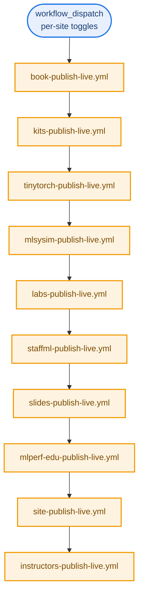

# CI Workflows: what actually runs and when

*This document inventories every GitHub Actions workflow in `harvard-edge/cs249r_book`, 66 files as of this writing, and explains the pattern they follow, what each one actually does, and the real quirks discovered by tracing several of them by hand rather than trusting their header comments alone. If you are trying to figure out why a badge is red, why a PR's checks never ran, or which workflow actually deploys a given site, start here. Read [`ecosystem-map.md`](ecosystem-map.md) first for how the projects relate to each other; this document is specifically about the automation that builds, tests, and ships them.*

## 1. The pattern almost every project follows

Ten of the eleven sub-projects (all except design-grammar and socratiq, see section 5) follow the same three-workflow shape, plus a fourth reusable one for anything that produces a PDF:

```
<project>-validate-dev.yml   tests, builds, lints. The thing that has to be green.
        |
        v
<project>-preview-dev.yml    deploys the validated build to a staging site.
        |
        v (manual only, requires typing a confirmation string)
<project>-publish-live.yml   deploys to mlsysbook.ai, the real production site.

<project>-build-pdfs.yml     reusable, called by preview and publish when a
                              project ships a downloadable PDF (guide, paper,
                              slide decks). Never runs standalone in the deploy path.
```

`validate-dev.yml` almost always declares three trigger types at once: `push` to `dev` (so the README badge reflects the branch's real state), `pull_request` (so a contributor's PR gets checked before merge), and `workflow_call` (so `preview-dev.yml` can invoke it directly as a job and gate deployment on it passing). This triple-trigger design is deliberate and documented consistently across the repo: it closes the exact race window where a preview could deploy on a commit its own validation had already failed on, and it means the same validate workflow that gates a PR is the one whose green run the badge actually reflects.

`publish-live.yml` is `workflow_dispatch`-only across every project, no automatic trigger ever ships to production. Most require typing a literal confirmation string as an input before the job proceeds.

## 2. The orchestrator: `publish-all-live.yml`



`publish-all-live.yml` holds no build logic of its own. Every step is a `uses:` call to that project's own standalone publish workflow, in the fixed order shown above, each waiting for the previous one to finish. This is a deliberate choice, not an oversight: the comment in the file states plainly that a project-specific `uses:` call can never drift out of sync with what running that project's publish workflow directly would do, since there is only one implementation, not a duplicated copy inside the orchestrator. Two defaults worth knowing: `deploy_book` defaults to `false` (the book release is heavier, opted in explicitly) and `site_only` defaults to `true` (most "publish all" runs are content refreshes, not full version-bumping releases).

The orchestrator also deliberately carries no workflow-level concurrency lock. Each child workflow declares its own `gh-pages-deploy` lock on its own deploy job. A lock at the orchestrator level would deadlock against its own children: the parent holds the lock, a child waits on it, the parent waits on the child, forever.

## 3. Per-project workflows

Each project's full workflow table now lives in its own folder, right next to its `design.md`, so it travels with the rest of that project's documentation instead of only existing in this one cross-cutting file. What follows is a collapsed summary per project, click to expand, or follow the link straight to the standalone file.

<details>
<summary><strong>Book</strong> (<code>book/</code>), 4 workflows, standard triad plus a reusable container build matrix</summary>

Full detail: [`book/ci-workflows.md`](book/ci-workflows.md)

`book-validate-dev.yml` runs pre-commit then a 12-job container build matrix (`book-build-container.yml`, reusable). `book-preview-dev.yml` deploys the validated artifacts to staging. `book-publish-live.yml` merges dev into main, rebuilds, tags, and generates AI-assisted release notes, reverting automatically on failure.
</details>

<details>
<summary><strong>Kits</strong> (<code>kits/</code>), standard triad plus one reusable PDF builder</summary>

Full detail: [`kits/ci-workflows.md`](kits/ci-workflows.md)

`kits-validate-dev.yml`, `kits-build-pdfs.yml` (reusable), `kits-preview-dev.yml`, `kits-publish-live.yml`.
</details>

<details>
<summary><strong>TinyTorch</strong> (<code>tinytorch/</code>), a 7-stage progressive test suite matrixed across Ubuntu and Windows</summary>

Full detail: [`tinytorch/ci-workflows.md`](tinytorch/ci-workflows.md)

`tinytorch-validate-dev.yml` runs inline build, unit, integration, and CLI tests in parallel, then end-to-end, a Docker fresh-install simulation, and an optional destructive full user-journey stage. `tinytorch-publish-live.yml` handles full semantic-versioning releases with a `site_only` escape hatch for pure content refreshes.
</details>

<details>
<summary><strong>MLSys·im</strong> (<code>mlsysim/</code>), standard triad plus PyPI publishing with a real post-publish smoke test</summary>

Full detail: [`mlsysim/ci-workflows.md`](mlsysim/ci-workflows.md)

`mlsysim-pypi-publish.yml` is the only publish pipeline in the whole repo that installs its own just-published package from real PyPI and smoke-tests it before declaring success.
</details>

<details>
<summary><strong>Labs</strong> (<code>labs/</code>), WASM smoke test tier, plus one real verified bug</summary>

Full detail: [`labs/ci-workflows.md`](labs/ci-workflows.md)

`labs-validate-dev.yml` builds wheels, exports representative labs to WASM, and runs them in real headless Chromium. Its dependency install step has no upper pin on `marimo`, which silently broke the job for weeks when `marimo` added a `uv` requirement, see the per-project file for the full trace.
</details>

<details>
<summary><strong>StaffML</strong> (<code>interviews/staffml/</code>), 7 workflows, the widest surface area of any sub-project, plus one real verified bug</summary>

Full detail: [`staffml/ci-workflows.md`](staffml/ci-workflows.md)

Site validation, vault data-layer validation, an opt-in Gemini-driven chain rebuild, a currently-inert monthly corpus audit (no `gemini` CLI on the runner yet), and the auto-PR/welcome-comment bots. A `github.workflow`-based concurrency collision used to make the vault validate job cancel itself against the site validate job on every single push, see the per-project file for the fix.
</details>

<details>
<summary><strong>Slides</strong> (<code>slides/</code>), 35 Beamer decks compiled to PDF and PPTX</summary>

Full detail: [`slides/ci-workflows.md`](slides/ci-workflows.md)

`slides-validate-dev.yml`, `slides-build-pdfs.yml`, `slides-preview-dev.yml` (portal only, no PDFs), `slides-publish-live.yml` (full PDF build plus a GitHub Release).
</details>

<details>
<summary><strong>MLPerf EDU</strong> (<code>mlperf-edu/</code>), documentation-only publishing, plus a recurring non-code CI failure</summary>

Full detail: [`mlperf-edu/ci-workflows.md`](mlperf-edu/ci-workflows.md)

Explicitly does not imply MLCommons endorsement or publish a benchmark result. `mlperf-edu-release-validation.yml` is the real, evidence-bearing benchmark run (5-hour timeout); `mlperf-edu-validate-dev.yml` is fast smoke validation only. Several Dependabot PRs against this project showed red CI from two pre-existing test bugs unrelated to the dependency bump, see the per-project file.
</details>

<details>
<summary><strong>Site</strong> (<code>site/</code>), the unified landing/about/community/newsletter site</summary>

Full detail: [`site/ci-workflows.md`](site/ci-workflows.md)

`site-validate-dev.yml`, `site-preview-dev.yml`, `site-publish-live.yml`, plus `site-refresh-stats.yml` (writes only `gh-pages/stats.json` every 6 hours) and `sync-newsletter.yml` (daily Buttondown sync, dispatches the real publish workflow rather than deploying itself, after a past partial-deploy corrupted shared CSS).
</details>

<details>
<summary><strong>Instructors</strong> (<code>instructors/</code>), standard triad, nothing unusual</summary>

Full detail: [`instructors/ci-workflows.md`](instructors/ci-workflows.md)

`instructors-validate-dev.yml`, `instructors-preview-dev.yml`, `instructors-publish-live.yml`.
</details>

## 4. Repo-wide and infrastructure workflows

These do not belong to any single project. Grouped by what they actually manage:

**Build acceleration and container health**

- `infra-container-linux.yml`, `infra-container-windows.yml`: build and push the pre-dependency Docker images referenced in `book/design.md`'s Docker section, the ones that cut local Linux setup time from roughly 45 minutes to 5 to 10. Linux rebuilds weekly; Windows rebuilds weekly two hours later, deliberately staggered.
- `infra-health-check.yml`: daily, pulls both images and runs a tool-presence and version matrix (Quarto, Python, R, TinyTeX, pandoc) to catch a container regression before it silently breaks every dependent build.
- `infra-cleanup-caches.yml`: weekly, purges GitHub Actions caches older than 14 days to control storage.

**Deployment support**

- `infra-cloudflare-purge.yml`: purges the entire Cloudflare edge cache after any production deploy completes. Chained off `workflow_run` rather than `push: gh-pages`, because GitHub deliberately suppresses workflow triggers from commits pushed using the default `GITHUB_TOKEN`, to prevent infinite trigger loops, and all nine publish-live workflows push to `gh-pages` with that same token.
- `infra-cloudflare-redirects.yml`: syncs a JSON-defined redirect table to Cloudflare's Redirect Rules API whenever `shared/config/cloudflare-redirects.json` changes, so legacy inbound links from before a content restructure keep resolving instead of 404ing.
- `infra-build-sitemap.yml`: reusable, aggregates every subsite's `sitemap.xml` under `gh-pages` into one root-level sitemap index. Intended to be called as the final step of any publish workflow.
- `infra-publish-guard.yml`: reusable, called from every `publish-live.yml`. Queries the most recent run of a named `validate-dev.yml` workflow on a given branch and fails the publish job outright if that run was not green or is older than a configurable max age (default 24 hours). This is the actual mechanism that prevents a production deploy from shipping an unvalidated baseline.
- `infra-visual-smoke.yml`: reusable, runs a real rendering check against an already-built site artifact (every stylesheet returns 200, no JS console errors, the homepage isn't blank, the navbar's responsive collapse breakpoints behave correctly in both light and dark). Currently called by TinyTorch's preview pipeline as a proof of concept, not yet adopted repo-wide.
- `infra-link-check.yml`: reusable Lychee scan, called by nearly every project's `validate-dev.yml` as the Tier 2 check (external link reachability, backstopping the Tier 1 pre-commit internal-link checker).
- `infra-link-rot-nightly.yml`: the Tier 3 check, a nightly cron sweep across every subsite whose results get written into one persistent, rewritten-each-run GitHub issue (`🔗 Link Rot Tracker`) rather than opening and closing dozens of one-off issues.

**Contributor and repo hygiene automation**

- `auto-label.yml`: hybrid labeling, deterministic file-path matching decides the area label on a PR, an LLM decides the type label on both issues and PRs, since a type label genuinely needs to read the natural-language content.
- `all-contributors-add.yml`: someone commenting `@all-contributors` on an issue or PR triggers LLM-based classification of what they contributed and updates the credit tables.
- `all-contributors-auto-credit.yml`: the same crediting logic but automatic, on every merged PR, using `pull_request_target` specifically because the default `pull_request` trigger gives fork PRs a read-only token that would silently swallow the credit-table commit. Its own comment is explicit about why this is safe despite the elevated permissions: it never checks out fork code, and the LLM prompt only ever ingests plain text (title, body, file paths), never executes anything fork-controlled.
- `update-contributors.yml`: regenerates the actual README contributor tables from the underlying config files, called by both of the above rather than duplicating that logic.
- `codespell.yml`: runs on every push and PR to `main`/`dev`. Deliberately does not maintain its own skip list, `pyproject.toml`'s `[tool.codespell]` block is the single source of truth, specifically so the ignore list can't drift between a config file and a workflow file.
- `ci-sanity.yml`: checks the CI system's own hygiene rather than any project's content. Its one current check, `workflow-fork-safety`, scans every `pull_request`-triggered workflow for a reference to `vars.*` or a non-`GITHUB_TOKEN` secret, both of which are silently unavailable to fork PRs and would otherwise cause a confusing, hard-to-diagnose failure only on external contributions.

## 5. What does not have a dedicated pipeline, and why

Two documented sub-projects have no `validate-dev`/`preview-dev`/`publish-live` triad of their own, confirmed by grepping the full workflow directory, not inferred from absence alone:

- **design-grammar** (full detail: [`design-grammar/ci-workflows.md`](design-grammar/ci-workflows.md)) is referenced only inside `book-validate-dev.yml` and `auto-label.yml`. It has no independent build or deploy pipeline, its content is validated as part of the book's own pipeline rather than standalone.
- **socratiq** (full detail: [`socratiq/ci-workflows.md`](socratiq/ci-workflows.md)) has exactly one workflow, `socratiq-bundle-drift.yml`, and it is a guard, not a deploy pipeline. socratiq is not an independently deployed site, it ships as a pre-built `bundle.js` embedded into the book's own build (`book/quarto/tools/scripts/socratiQ/bundle.js`), and this workflow's entire job is to rebuild that bundle from source on any relevant PR and fail if the committed bundle has drifted from what the source actually produces. This is exactly the check that flagged real drift on two Dependabot PRs (`linkify-it` and `dompurify`) traced in detail while reviewing this repo's open PRs, both bumped a version Dependabot could update in `package.json` but had no way to rebuild the bundle for, so the check correctly caught that the shipped code would not have matched the new dependency version.

## 6. Two real, verified bugs in this CI system

Both of these were found by tracing an actual failing run end to end, not by reading the workflow file and guessing.

**`labs-validate-dev.yml`'s WASM smoke test can fail for a reason unrelated to any lab's content.** The `wasm-smoke-test` job's dependency install step (`pip install build marimo`) pulls the latest `marimo` release with no upper version pin. A `marimo` release was found to have added a hard requirement on `uv` for `html-wasm` export's local-import resolution, and the job never installed `uv`. Because this job only re-runs when a push touches `labs/**` or `mlsysim/**`, the break sat live and undetected on `dev` for weeks between the `marimo` release that introduced it and the next relevant push. The fix is a one-line addition (`pip install build marimo uv`), but the underlying risk (an unpinned upstream dependency with no scheduled health check) remains unless the job either pins `marimo`'s upper bound or the dependency install step gets a periodic, path-independent trigger.

**`staffml-validate-vault.yml`'s concurrency group was, until a documented fix, silently colliding with `staffml-validate-dev.yml`'s.** Both are called via `workflow_call` from the same parent, `staffml-preview-dev.yml`. Before the fix (landed 2026-05-02 per the workflow's own comment), both reusable workflows resolved their concurrency group key from `${{ github.workflow }}`, which evaluates to the *caller's* workflow name inside a `workflow_call`, not the callee's own name. That meant both vault-validate and dev-validate produced the identical group key whenever invoked from the same parent run, and GitHub's `cancel-in-progress` behavior silently killed whichever queued a few seconds later, turning the StaffML README badge red on every single push despite every real check having actually passed. The fix uses a literal, workflow-identifying string plus `${{ github.head_ref || github.run_id }}` instead of `${{ github.workflow }}`, so each reusable workflow's group key is genuinely unique per invocation regardless of which parent called it. This exact bug class is worth checking for in any new reusable workflow this repo adds: if two `workflow_call` targets are ever invoked from the same parent and either one's concurrency group derives from `github.workflow` without a literal override, they will collide.
