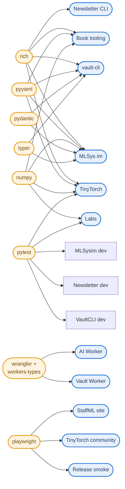

# Dependency Map

*This document is sourced directly from GitHub's own dependency graph for `harvard-edge/cs249r_book` (the Insights tab's "Dependency graph" view, fetched via the repo's SBOM and GraphQL API), cross-checked against the real manifest files for the projects covered elsewhere in this docs set. It answers two different questions: how big is the full dependency surface (every resolved package, direct and transitive), and which specific packages does each sub-project actually declare and why. The first number is what security tooling cares about. The second is what a contributor changing a dependency needs.*

## 1. The full picture, as GitHub sees it

GitHub's dependency graph resolves **1,629 unique packages** across **117 manifest files** in this repository.

| Ecosystem | Resolved packages |
|---|---|
| npm | 1,188 |
| PyPI | 415 |
| GitHub Actions | 25 |
| git submodule/other | 1 |

The npm total dwarfs everything else, and that is expected, not a red flag: a single Next.js app (StaffML) or a single Vite-bundled widget (SocratiQ) pulls in hundreds of transitive npm packages through its build tooling alone, while this repo's Python side stays comparatively lean because most Python projects here declare a short, deliberate dependency list rather than a full data-science stack.

117 manifest files is also a real number worth sitting with: this repo tracks dependencies for eleven sub-projects, five VS Code extensions (one each for book, kits, labs, mlsysim, tinytorch), two Cloudflare Workers, a shared type package, a release-smoke test harness, and 25 GitHub Actions treated as their own dependency class. A dependency bump anywhere in this repo is realistically touching one of well over a hundred independently-versioned surfaces, not a handful.

## 2. Per-project direct dependencies

This is the part GitHub's aggregate number can't show you: what each project's own manifest actually declares, read directly from source rather than inferred. "Direct" means declared in that project's own `pyproject.toml`/`package.json`, not the full resolved tree.

### Python projects

| Project | Manifest | Direct dependencies |
|---|---|---|
| Book tooling (the Binder CLI) | `pyproject.toml` (root) | `jupyterlab-quarto`, `jupyter`, `pybtex`, `pypandoc`, `pyyaml`, `pandas`, `numpy`, `jsonschema`, `Pillow`, `requests`, `titlecase`, `rich`, `typing-extensions`, `click` |
| TinyTorch | `tinytorch/pyproject.toml` | `numpy`, `rich`, `PyYAML`, `certifi`, `pytest` (+dev: `nbdev`, `jupytext`, `nbformat`, `jupyter`, `jupyterlab`, `ipykernel`) |
| MLSys·im | `mlsysim/pyproject.toml` | `pint`, `pydantic`, `numpy`, `typer`, `rich`, `pyyaml` (+optional: `scipy`, `ortools`, `plotly`/`matplotlib`, `mcp`, `pandas`) |
| Labs | `labs/pyproject.toml` + `labs/requirements.txt` | `marimo`, `plotly`, `numpy`, `pytest` |
| StaffML content pipeline (`vault-cli`) | `interviews/vault-cli/pyproject.toml` | `typer`, `pydantic`, `pyyaml`, `click`, `rich`, **not** `linkml` (see [`staffml/system_design.md`](staffml/system_design.md) section 7) |
| Site newsletter CLI | `site/newsletter/pyproject.toml` | `rich`, `requests`, `python-frontmatter` (+dev: `pytest`, `ruff`) |

### Node/npm projects

| Project | Manifest | Direct dependencies |
|---|---|---|
| Root tooling | `package.json` (root) | `puppeteer` only |
| StaffML frontend | `interviews/staffml/package.json` | `next`, `react`/`react-dom`, `sigma`/`graphology`/`@react-sigma/core`, `katex`, `js-quantities` (+dev: `vitest`, `@playwright/test`, `js-yaml`) |
| StaffML vault Worker | `interviews/staffml-vault-worker/package.json` | Zero runtime dependencies, raw Workers code. Dev-only: `wrangler`, `@cloudflare/workers-types`, `typescript`, `vitest` |
| StaffML AI interviewer Worker | `interviews/staffml/worker/package.json` | Same pattern, zero runtime deps, dev-only `wrangler`/`@cloudflare/workers-types`/`typescript` |
| StaffML shared types | `interviews/staffml-vault-types/package.json` | Zero dependencies of any kind, pure TypeScript type definitions consumed by the site and both Workers |
| design-grammar | `design-grammar/package.json` | `js-yaml`, one real dependency, for its grammar.yml build scripts |
| SocratiQ | `socratiq/package.json` | 15 direct runtime dependencies (see section 3, this is the most heavily-documented dependency list in the repo) |
| Release smoke tests | `tools/release-smoke/package.json` | `playwright` |
| TinyTorch community dashboard tests | `tinytorch/quarto/community/package.json` | `@playwright/test`, dev-only |

Kits, slides, mlperf-edu, instructors, and the main site have no dependency manifest of their own beyond what the book's shared tooling and Quarto itself provide, they are content-and-Quarto-config projects, not separately-dependent codebases.

## 3. SocratiQ's dependency list is worth reading in full

SocratiQ's `package.json` carries an inline `_comments` block auditing every one of its 15 runtime dependencies by approximate bundle size and why it is kept, the only project in this repo that documents its own dependency list this rigorously, directly in the manifest:

```
@leeoniya/ufuzzy    ~12KB    fuzzy paragraph search, core highlight flow
boarding.js         ~50KB    onboarding tour, lazy after first-visit check
chart.js             ~200KB  tree-shaken named imports only, not chart.js/auto
compromise            ~1.5MB  NLP: offline quiz fallback, topic tagging, stop-words
crypto-js             ~80KB   SHA-256 PDF verification (SubtleCrypto could replace it)
d3                     ~570KB  KnowledgeGraph.js only, flagged for a subpackage trim
dompurify              ~45KB   XSS sanitization, security-critical (see ci-workflows.md)
idb                    ~8KB    IndexedDB wrapper for quiz/spaced-rep storage
ink-mde                ~150KB  flashcard markdown editor, lazy-loaded
jsonrepair             ~30KB   repairs malformed LLM JSON responses
jspdf + jspdf-autotable ~330KB  PDF export, loaded only on explicit export
katex                  ~280KB  math rendering
markdown-it (+container)~65KB  core markdown parsing
mermaid                ~800KB  diagram rendering, lazy-initialized, largest single dep
```

Two things worth pulling out of this. First, `dompurify` is explicitly annotated as "added for security fixes," it is the actual XSS defense sanitizing AI-generated content before DOM injection, and its Dependabot bump is one of the two currently blocked on a bundle rebuild documented in [`socratiq/ci-workflows.md`](socratiq/ci-workflows.md). Second, `d3` is self-flagged in the manifest as a `REVIEW`, not a `KEEP`, the maintainers already know it is oversized for what it is used for (one component, `KnowledgeGraph.js`) and have left a note about trimming it to specific subpackages, this is documented technical debt sitting directly in the dependency file itself, not something discovered externally.

## 4. Dependencies that show up in more than one project

Cross-referencing the direct dependency tables above surfaces a real pattern: several choices are repo-wide conventions, not coincidences.



- **`rich`** is the de facto standard for CLI console output across every Python CLI in this repo, the Binder CLI, `tito`, `mlsysim`, `vault-cli`, and the newsletter CLI all use it, none of them use `click`'s own output helpers or a competing library for this.
- **`pyyaml`** is the shared choice for config and registry parsing across the book tooling, TinyTorch's milestone config, MLSys·im's registries, and vault-cli's question schema.
- **`numpy`** appears in the book tooling, TinyTorch (as the actual tensor backend), MLSys·im, and Labs, though it plays a genuinely different role in each, general data processing in the book tooling, the literal tensor math in TinyTorch.
- **`pydantic`** and **`typer`** both appear in exactly two places, MLSys·im and vault-cli, a smaller but real convergence on schema validation and CLI-building choices between two otherwise unrelated projects.
- **`wrangler`** and **`@cloudflare/workers-types`** are shared, pinned identically, across both StaffML Cloudflare Workers, meaning a version bump like the one attempted in PR #1965 (blocked on a peer-dependency conflict, see [`staffml/ci-workflows.md`](staffml/ci-workflows.md)) needs to be considered against both Workers' `@cloudflare/workers-types` pin, not just one.
- **`playwright`** (or `@playwright/test`) is the shared end-to-end testing choice across the release-smoke harness, the TinyTorch community dashboard's own test suite, and StaffML's validate pipeline, plus the Python `playwright` package independently in Labs' `browser_smoke.py`, a different ecosystem but the identical tool, for the identical reason: catching real-browser bugs nothing else can.

## 5. What this means for dependency review

If you are reviewing a Dependabot PR, the honest question is never just "does this project's own code use the package," it is also "does a sibling project pin the same package, and does bumping one without the other create drift." The `wrangler` case in section 4 is the concrete example: two Workers, two separate `package.json` files, one shared version convention, and a bump to one that doesn't account for the other is exactly how PR #1965 ended up broken as submitted.
