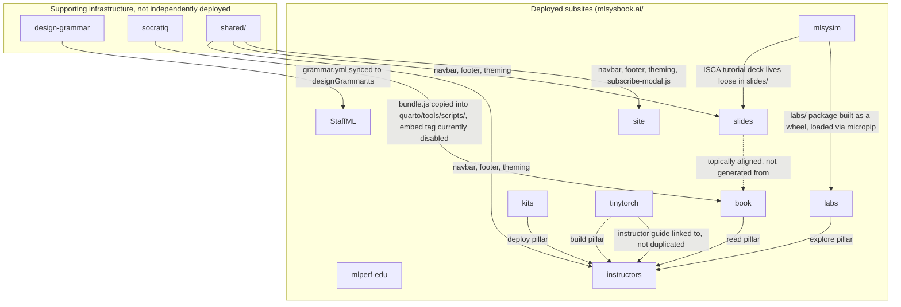

# The MLSysBook Ecosystem: How the Pieces Connect

*This is a companion document to the eleven per-project design and implementation docs in this repository. Where those documents describe one project in depth, this one is the map of the whole `harvard-edge/cs249r_book` monorepo: which projects depend on which, which are deployed where, and which pieces of shared infrastructure tie them together. Read the per-project docs for depth; read this one first for orientation. Reflects `dev` HEAD (commit `8fb87d81`, 2026-08-05).*

## The ten deployed subsites

Ten of the eleven documented projects are independently deployable sites or packages, each with its own `<project>-validate-dev.yml`, `<project>-preview-dev.yml`, and `<project>-publish-live.yml` workflow triple. A single orchestrator workflow, `publish-all-live.yml`, exists specifically to deploy all of them together when needed; it is explicitly a thin dispatcher with no build logic of its own; every actual build and deploy step still lives in the individual project's own standalone workflow, so the orchestrator can never drift out of sync with what running a project's publish workflow directly would do. Its own comments document the release order:

```
1. BOOK        (book-publish-live.yml)        Quarto render + release
2. KITS        (kits-publish-live.yml)
3. TINYTORCH   (tinytorch-publish-live.yml)
4. MLSYSIM     (mlsysim-publish-live.yml)     with quartodoc
5. LABS        (labs-publish-live.yml)
6. STAFFML     (staffml-publish-live.yml)     Next.js + D1 + Worker
7. SLIDES      (slides-publish-live.yml)      lecture-deck PDFs
8. MLPERF EDU  (mlperf-edu-publish-live.yml)  independent preview docs
9. SITE        (site-publish-live.yml)        landing + about + community
10. INSTRUCTORS (instructors-publish-live.yml)
```

Book deploys are off by default in this orchestrator (opted in explicitly, since a full book release is heavier than a routine content refresh); every other subsite defaults to on. Two of the eleven projects documented in this repository, Socratiq and the ML Systems Design Grammar, are notably absent from this list: neither has its own `-publish-live.yml` or deploys to its own `mlsysbook.ai/<path>/`. That absence is itself informative, both are supporting infrastructure consumed by other projects rather than independently published products; see below.

## The dependency graph



## The connections, one by one

### design-grammar to StaffML

The ML Systems Design Grammar catalog (`design-grammar/grammar.yml`) is not itself deployed anywhere. Its one confirmed downstream consumer is StaffML: `interviews/staffml/scripts/sync-design-grammar.mjs` reads the catalog directly and generates `interviews/staffml/src/data/designGrammar.ts`, which StaffML's `/framework` page imports from. This sync runs automatically as part of StaffML's own `npm run dev`/`npm run build` lifecycle, so a StaffML contributor gets a fresh copy of the catalog without needing to know the Design Grammar project exists. No other subsite (the book, kits, slides) references the catalog. See `design-grammar-design.md`'s "Architecture: Downstream consumption" and `staffml-implementation.md` for the sync mechanics.

### Socratiq to the book

Socratiq (`socratiq/`) is also not independently deployed. Its production build's own Vite plugin copies the built `bundle.js` directly into three locations inside `book/quarto/tools/scripts/socratiQ/` on every build, so building Socratiq is also the mechanism that updates the book's copy. A dedicated CI workflow (`socratiq-bundle-drift.yml`) guards against a contributor editing Socratiq's source and forgetting to rebuild. As documented in both projects' "Known issues," the actual `&lt;script&gt;` tag that would activate the widget on the live book is currently commented out in both volume configs, so this connection exists as real, tested infrastructure that isn't currently live for a reader.

### MLSys·im to labs

MLSys·im (`mlsysim/`) is a published PyPI package in its own right, and also the physics engine every one of the 34 browser-based labs (`labs/`) runs on. At build time, `mlsysim` is compiled to a wheel and loaded into each lab's Pyodide/WASM runtime via `micropip`, so a lab is running the literal same `mlsysim` code as the CLI and the PyPI package, not a simplified or reimplemented subset. This is documented in depth in `mlsysim-design.md`'s "Labs: browser-based interactive exercises" section.

### MLSys·im to slides

A loose, standalone Beamer file, `slides/mlsysim_tutorial.tex`, is the ISCA-conference-tutorial deck for the MLSys·im project. It lives inside the `slides/` project's directory but is not part of the `vol1`/`vol2` chapter-deck structure and isn't built by the `slides/Makefile`; if you're looking for it, it's a genuine outlier in that directory.

### TinyTorch to the instructor site

The instructor site (`instructors/`) deliberately does not duplicate TinyTorch's own grading documentation. Its sidebar links directly to TinyTorch's `INSTRUCTOR.md` on GitHub rather than hosting a local copy, keeping that content owned in exactly one place.

### The "four pillars," book, TinyTorch, labs, and kits, via the instructor site

The instructor site's `course-map.qmd` is the one place in the whole ecosystem that explicitly documents how four otherwise-separate projects are meant to be used together week by week in an actual course: **Read** the textbook (`book/`), **Build** a framework from scratch (`tinytorch/`), **Explore** interactive labs (`labs/`, backed by `mlsysim/`), and **Deploy** to real hardware (`kits/`). None of the four projects' own documentation states this relationship as directly; it only becomes visible from the instructor site's perspective.

### `shared/` to site, slides, and instructors

A monorepo-level `shared/` directory (a sibling to every project, not inside any of them) supplies a common navbar definition, shared footer content, shared light and dark SCSS theming, and a shared `&lt;head&gt;` include, consumed via each project's `_quarto.yml` `metadata-files`. Confirmed consumers: `site/`, `slides/`, and `instructors/`. The book and kits projects were checked and do not reference `shared/` directly; they maintain their own configuration instead. `shared/scripts/subscribe-modal.js` specifically is mirrored (as real file copies, not symlinks, since Quarto's GitHub Pages deploy step doesn't dereference symlinks cleanly) into consuming projects by a manually-run sync script, `shared/scripts/sync-mirrors.sh`; see `site-design.md`'s "Known issues" for the gap in how reliably that staleness is actually caught.

### Slides to the book, topical alignment only, no generation

Every slide deck's directory name and chapter number matches a corresponding book chapter, and the slides portal explicitly states the decks are "derived from" the textbook. But there is no build script, generator, or automated content pipeline connecting the two; slide content is entirely hand-authored LaTeX, independently maintained. Don't assume editing a book chapter has any effect on its corresponding deck, or vice versa.

### The TinyML track: an external repository, not an internal connection

Worth noting precisely because it looks like an internal connection and isn't one: the TinyML course content referenced from both `slides/tinyml.qmd` and `instructors/tinyml-syllabus.qmd` is not maintained anywhere in this monorepo. It lives in a separate, external repository (`tinyMLx/courseware`) and is fetched fresh and packaged into `slides/`'s release artifacts only at publish time. If you're trying to edit TinyML slide or reading content, you need to go to that external repository, not this one.

### The naming collision: "Binder" (book/binder) versus binder/ (repo root)

Not a functional connection, but a real, documented source of confusion covered in the book's own docs: the book project's CLI is called "Binder" (`book/binder`). A completely unrelated, identically-named `binder/` directory exists at the repository root, holding mybinder.org (Jupyter notebook launch) configuration that is actually a redirect wrapper for TinyTorch's own separate Binder configuration at `tinytorch/binder/`. The two concepts share a name by coincidence only.

### The one canonical contribution router: the root `CONTRIBUTING.md`

Rather than every project explaining "how do I contribute to the whole ecosystem," that routing function lives in exactly one place, the repository root's `CONTRIBUTING.md`, which has a table mapping a contributor's intent directly to the right project's own contributing guide:

| If you want to... | Read |
|---|---|
| Fix a typo, improve a chapter, add a figure | `book/docs/CONTRIBUTING.md` |
| Add or fix a TinyTorch module, test, or milestone | `tinytorch/CONTRIBUTING.md` |
| Improve a hardware lab or board recipe | `kits/README.md` |
| Add or fix an interactive lab | `labs/README.md` |
| Contribute an MLSys·im model, scenario, or scorecard | `mlsysim/docs/contributing.qmd` |
| Add a workload to the MLPerf EDU benchmark suite | `mlperf-edu/README.md` |
| Author or fix a StaffML interview question | `interviews/CONTRIBUTING.md` |
| Improve teaching materials, syllabi, or rubrics | `instructors/README.md` |
| Update slides for a chapter | `slides/README.md` |
| Change the unified landing site, newsletter wiring, or games | `site/README.md` |

Neither Socratiq nor the Design Grammar has a row in this table, consistent with their role as infrastructure consumed by other projects rather than destinations a contributor would target directly.

## What this means if you're new here

If you're deciding where to make your first contribution, three things are worth knowing before you start:

1. **Ten projects deploy independently; two (Socratiq, Design Grammar) are infrastructure consumed by others.** If you're fixing something in one of the two, your change's visible effect will show up somewhere else (StaffML's `/framework` page, or the book's widget, once it's re-enabled), not in a site of its own.
2. **The "four pillars" framing (book, TinyTorch, labs, kits) only exists in the instructor site's documentation.** If you're trying to understand how the core teaching projects relate as a whole, `instructors/course-map.qmd` is the one place that actually explains it; none of the four projects' own docs state it from their own side.
3. **Two apparent connections are traps, not real ones.** Slides look generated from the book but aren't (they're independently authored and only topically aligned), and the "Binder" name means two completely different things depending on whether you're inside `book/` or standing at the repository root.
