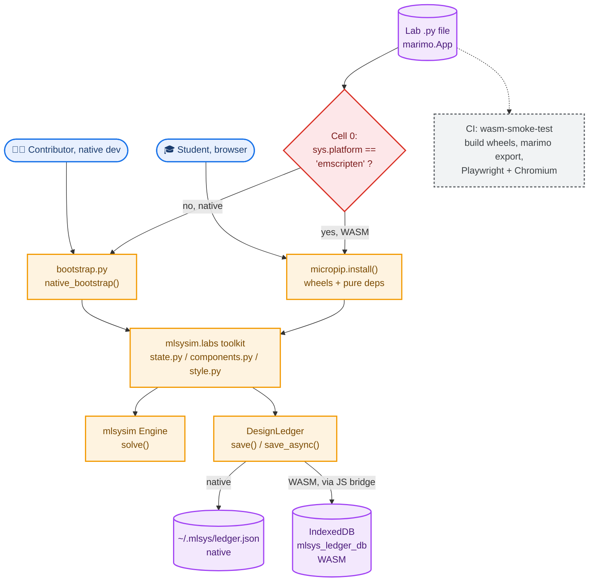

# Labs: System Design

*This document describes how the 34 browser-based interactive labs (`labs/vol1/`, `labs/vol2/`) are built, exported, run, and how they persist student progress. It is written for a contributor who needs to understand the mechanics well enough to add a lab, fix an export failure, or debug a persistence bug, not just to know that labs exist. Read [`../mlsysim/design.md`](../mlsysim/design.md) first if you have not, since labs run entirely on the mlsysim engine and share its Python package. All facts below are sourced from the real files in `labs/`, `mlsysim/mlsysim/labs/`, and `.github/workflows/labs-validate-dev.yml`, not from prose descriptions elsewhere in this repo.*

## 1. Problem this system solves

A lab has to run two genuinely different lives from one source file: a native Python notebook a contributor edits locally, and a WASM export a student runs with no server, no install, and no account, directly in a browser tab. Both lives have to execute identical simulation logic against the same `mlsysim` engine, and both have to remember what the student did between visits. The system exists to make that split invisible to the lab author: one `.py` file per lab, one conditional branch at the top of it, and everything downstream (the physics, the UI, the save-and-resume behavior) is the same code in both environments.

## 2. Dependencies and what each one actually does here

| Dependency | Declared in | What it does in this codebase |
|---|---|---|
| `marimo>=0.23.1` | `labs/requirements.txt` | The notebook runtime. Every lab is a `marimo.App` built from `@app.cell`-decorated functions. Also owns the export mechanism (`marimo export html-wasm`) that turns a lab into a static, browser-runnable HTML file. |
| Pyodide (via CDN, plus `micropip`) | fetched at runtime, not pinned in `requirements.txt` | The CPython-to-WASM runtime a browser actually executes. `micropip` is Pyodide's package installer; each lab's first cell calls `micropip.install(...)` for pure-Python dependencies (`pydantic`, `pint`, `plotly`, `pandas`) and then installs two locally-built wheels by relative path. |
| `mlsysim` (built as a wheel for WASM, installed from source for native dev) | `mlsysim/pyproject.toml`, pinned `0.1.2` | The simulation engine every lab calls into. Version pin in the wheel filename baked into each lab's first cell has to track the pin in `mlsysim/pyproject.toml`, or a lab installs a mismatched engine. |
| `mlsysim.labs` (the `mlsysbook-labs` package, `labs/pyproject.toml`) | declared with zero runtime dependencies of its own | A UI-and-persistence helper package, not a second engine. Supplies `DesignLedger`, the shared card/metric/roofline widgets, and the shared color and CSS theme every lab imports so 34 notebooks do not each reinvent their own layout. |
| `plotly>=6.7.0`, `numpy>=1.24.0` | `labs/requirements.txt` | Direct plotting and numeric dependencies used inside lab cells, separate from whatever `mlsysim` itself pulls in. |
| `pytest>=8.0.0` | `labs/requirements.txt` | Runs the five-tier test suite described in section 5. |

## 3. Full system diagram



The red diamond is the one decision every lab makes, and it is the only place native and WASM code paths diverge. Everything below the toolkit box runs identically regardless of which branch was taken. The dashed line to CI represents a check, not a runtime dependency, the WASM smoke test consumes the same lab file a student's browser does, it does not sit in the path between them.

## 4. Component inventory

```
                         labs/vol1/lab_00_introduction.py
                         labs/vol2/lab_17_fleet_synthesis.py
                         ... 34 lab files total ...
                                     |
                    each imports and calls into
                                     v
          +--------------------------------------------------+
          |            mlsysim.labs (shared toolkit)          |
          |----------------------------------------------------|
          | state.py      -> DesignLedger / LedgerState        |
          | components.py -> Card, MetricRow, RooflineVisualizer|
          |                  LatencyWaterfall, DecisionLog,    |
          |                  FailureBanner, MapDashboard, ...  |
          | style.py      -> COLORS, LAB_CSS, apply_plotly_theme|
          +--------------------------------------------------+
                                     |
                        calls into for computation
                                     v
                       +---------------------------+
                       |     mlsysim (engine)       |
                       |  Engine.solve(), registries|
                       +---------------------------+
```

Alongside the labs themselves and the shared toolkit, two more pieces matter:

- **`labs/bootstrap.py`**, a native-only convenience shim. `native_bootstrap(lab_file)` puts the repository root and `mlsysim/` onto `sys.path` so a lab can `import mlsysim` from source during local editing. It is an explicit no-op under WASM (`sys.platform == "emscripten"`), and it cannot run inside a WASM export in the first place, because marimo's `html-wasm` export bundles only the notebook file itself.
- **The five-tier test suite** under `labs/tests/`, described fully in section 5.

## 5. The five test tiers and what each one actually catches

```
Level 1  test_static.py    static analysis, no execution
Level 2  test_engine.py    headless app.run(), catches runtime errors
Level 3  test_widget.py    prediction-widget wiring, aspirational (continue-on-error)
Level 4  test_protocol.py  pedagogical structure invariants
Level 5  browser_smoke.py  real headless Chromium against a real WASM export
         test_wasm_persistence.py  real Pyodide + real IndexedDB, no mocking
```

Level 1 through 4 run against the native Python module, imported directly. Level 5 is the one that matters most and is the most expensive to run, because it is the only tier that exercises the actual browser environment a student uses. This distinction exists for a documented reason: issue #1353 was a lab that shipped broken to production, a `plotly` import placed before its own `micropip.install()` call, and every other tier (static analysis, native engine execution, even a Node-based Pyodide import check) passed cleanly while the real browser failed. `browser_smoke.py`'s CI selection of labs to check is not random: it explicitly includes `vol2/lab_05_dist_train`, the lab that originally shipped broken, as a standing regression guard.

`browser_smoke.py` defines a boot timeout of 180 seconds (Pyodide plus two wheel installs plus cell execution is slow), a shell timeout of 30 seconds for the first DOM paint, and a 5-second settle buffer after that. A lab counts as healthy only if a recognizable marimo DOM element attaches in time, the page reaches network idle within the boot timeout, and, if the lab uses tabs, at least one tab is both attached and visible. It also scans every browser console line for marimo's own exception-reporting format, since marimo routes Python tracebacks to `console.log` rather than `console.error`, which a naive `console.error`-only check would silently miss.

`test_wasm_persistence.py` is narrower and newer: it exists specifically to catch a class of bug where `DesignLedger.save_async()` reports success while the write silently never lands in IndexedDB (issue #1985). It runs the real, unmodified `save_async()` against a real Pyodide runtime and real IndexedDB in headless Chromium, then reads the result back through a second, independent connection, five separate trials, rather than trusting the save call's own return value.

## 6. Export and boot sequence, from source file to a running tab

```
CI job "wasm-smoke-test" (labs-validate-dev.yml)

  1. build mlsysim wheel        python -m build --wheel   -> mlsysim-0.1.2-*.whl
  2. build labs helper wheel    python -m build --wheel   -> mlsysbook_labs-0.1.0-*.whl
  3. copy both wheels into      /tmp/wasm-smoke/wheels/
  4. marimo export html-wasm    per lab  -> /tmp/wasm-smoke/<lab>/index.html
  5. Playwright + Chromium      loads index.html for real

Inside the browser, once index.html loads:

  Cell 0 runs first
    |
    +-- sys.platform == "emscripten"?  -> yes, we are in WASM
    |     |
    |     +-- micropip.install(["pydantic", "pint", "plotly", "pandas", ...])
    |     +-- micropip.install("../../wheels/mlsysim-0.1.2-*.whl")
    |     +-- micropip.install("../../wheels/mlsysbook_labs-0.1.0-*.whl")
    |
    +-- sys.platform != "emscripten" -> no, this is native dev
          |
          +-- labs.bootstrap.native_bootstrap(__file__)
                puts repo root and mlsysim/ on sys.path,
                imports mlsysim and mlsysbook_labs from source

  Only after Cell 0 resolves does the lab import DesignLedger,
  the shared UI components, and call into the mlsysim engine.
```

The wheel filenames baked into each lab's Cell 0 have to match what the CI build step actually produces, and the wheel directory has to sit at the exact relative path each lab expects (`../../wheels/`), because Pyodide's worker resolves wheel paths relative to the worker script, not the page. This is why the CI job explicitly duplicates the wheel copies into each volume's own build directory rather than sharing one location.

Everything downstream of Cell 0 is identical code in both environments. There is no separate production notebook and no forked logic for the physics, the widgets, or the save behavior. The only structural difference between a contributor's local session and a student's browser session is that one conditional branch, and `test_static.py`'s `test_wasm_bootstrap` check enforces, by literal string match, that the branch exists verbatim in every lab file.

## 7. Progress persistence: input, storage, and the JS bridge

`DesignLedger` is the one persistence path every lab uses, through `save(track=..., step=..., design=..., chapter=...)`. A call first mutates the in-memory `LedgerState` (`track`, `current_step`, `history[step_id]`), synchronously, regardless of environment. What happens next branches:

```
DesignLedger.save(...)
        |
   mutate in-memory LedgerState
        |
   is_wasm?
    /        \
  no          yes
   |            |
   v            v
write JSON    fire background task: save_async()
to disk           |
~/.mlsys/          +-- json.dumps(LedgerState)
ledger.json        +-- stash on globalThis._mlsys_temp_state
                    +-- run_js(...) opens IndexedDB
                          "mlsys_ledger_db", store "ledger"
                          store.put(bridge value, "mlsys_design_ledger")
                          resolves only on tx.oncomplete,
                          not merely on the put() request succeeding
```

The JS bridge variable is named `_mlsys_temp_state`, a single leading underscore rather than a double one, and that spelling is deliberate, not cosmetic. Python silently mangles any double-underscore-prefixed name written inside a class body, which previously desynced the Python-side write from the plain name the embedded JS string expected to read, and the fix (and the comment explaining it) lives directly in `save_async()`.

The WASM save is fire-and-forget by design (a lab's UI cannot block on a full IndexedDB round trip without stalling the interaction), so failure detection is handled separately, and this is where a real data-loss bug lived until PR #1988 (2026-08-10): the background task was a bare `asyncio.create_task(...)` with no callback attached, so an IndexedDB failure (quota exceeded, private-browsing storage denial, anything) vanished into an unobserved task. A student could lose progress across any of the 34 labs with zero indication anything went wrong.

The fix attaches a done-callback to the background task and exposes two new properties: `last_save_error` (set to the exception string on failure, cleared to `None` on the next successful save) and `save_pending` (`True` while the background write is in flight). `save()` itself is unchanged in signature and still returns immediately without blocking. Two new methods exist for callers that need a stronger guarantee than fire-and-forget:

- **`asave(...)`**, an async variant of `save()` for callers that can `await`, it performs the same write but propagates the exception directly to the caller instead of only recording it on `last_save_error`.
- **`flush()`**, awaits whatever background save is currently in flight (if any) and re-raises its exception if it failed, for a caller that needs to confirm a prior fire-and-forget `save()` actually landed before proceeding.

`save_async()`'s own failure mode changed too: it now raises on an IndexedDB failure instead of swallowing it into a bare `print()`. Four regression tests landed in `mlsysim/tests/test_state.py` alongside the fix, covering the native roundtrip, a successful WASM save clearing `last_save_error`, a failing WASM save being captured on `last_save_error` rather than silently dropped, and `asave()` propagating its exception directly.

Native persistence is the simpler of the two paths on purpose: a JSON file at `~/.mlsys/ledger.json`, written and read with the standard library, no browser storage API involved, since a native session has no browser to talk to.

## 8. Error handling

Both the native and WASM load paths fail the same way on purpose: on any exception, `LedgerState` resets to a fresh, empty default rather than raising. This is the correct behavior for "no prior save exists" and the wrong behavior for "a save exists but could not be read", and the two cases currently cannot be told apart from the caller's side, tracked as [issue #1994](https://github.com/harvard-edge/cs249r_book/issues/1994), still open as of 2026-08-10, and a direct sibling of the write-side bug PR #1988 fixed below: same silent-failure shape, opposite end of the read/write path.

On the write side, `save_async()`'s background task failure is captured explicitly rather than silently dropped: the done-callback records the error on `last_save_error` and logs it through the browser console, falling back to a plain `stderr` print if the console itself is unreachable. This replaced an earlier version of the code where a save failure could vanish entirely, with the caller believing the write had succeeded, see the expanded writeup in section 7.

`browser_smoke.py` treats any unexpected browser console error, any failed page load within its timeouts, or any missing expected UI element as a hard failure of that lab, there is no partial-credit or warning-only outcome at this tier.

## 9. How this connects to the rest of the ecosystem

```
    mlsysim source            mlsysim wheel
  (native dev, editable) --+  (WASM, micropip.install)
                            |
                            v
                   labs/vol1/, labs/vol2/
                            |
                mlsysim.labs shared toolkit
              (state.py, components.py, style.py)
                            |
              labs-validate-dev.yml (CI)
              validate-notebooks job:  installs mlsysim from source
              wasm-smoke-test job:     builds and installs mlsysim as a wheel
```

Local development and CI's native-facing test tiers install `mlsysim` from source, an editable install that always reflects whatever is currently on the branch. The WASM path, both in CI and in what a real student's browser fetches, installs a compiled wheel instead. This means the two code paths can, in principle, drift apart if the wheel build step and the source tree disagree, which is exactly why `browser_smoke.py` exists as a separate, mandatory tier rather than trusting the native test tiers to stand in for the WASM behavior.

## 10. Contributing

If you are adding a new lab, copy the Cell 0 pattern from an existing lab exactly, do not write your own environment-detection logic. If you are debugging a persistence bug, check `mlsysim/design.md`'s project history first, this exact subsystem has a documented history of subtle, hard-to-reproduce bugs (the plotly-import-order incident, the name-mangling incident), and the fix for a new bug in this area should come with a permanent regression test in the same style as `test_wasm_persistence.py`, not a one-off manual check.
