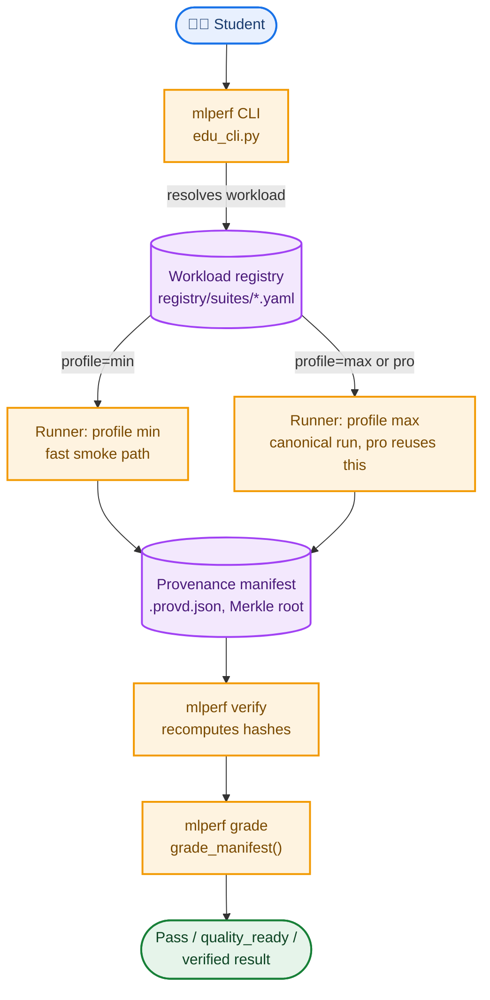

# MLPerf EDU: System Design

*This document describes how a student's benchmark run actually gets executed, verified, and graded, and how the anti-cheat system evolved after a real, previously-shipped bypass bug. It is written for a contributor adding a workload or changing the grading path. All facts below are sourced from `mlperf-edu/pyproject.toml`, `src/mlperf/edu_cli.py`, `src/mlperf/registry.py`, and `src/mlperf/manifest.py`.*

## 1. Problem this system solves

A classroom benchmark has to let a student run something fast enough to iterate on (a "min" profile smoke run) while still being able to produce a real, trustworthy result when it matters (a "max" profile canonical run), and it has to prove that result wasn't faked, self-reported metrics are worthless if nothing checks whether the code that produced them actually ran. This system solves both with one registry-driven dispatch mechanism (the same runner code serves both profiles) and a cryptographic provenance manifest that gets independently recomputed and compared at grading time, not merely trusted.

## 2. Dependencies and what each one actually does here

Unlike most projects in this repo, `mlperf-edu` declares real, heavy ML dependencies, because it actually executes workloads, not just describes them: `torch`, `torchvision`, `transformers`, `sentence-transformers`, `torch-geometric` plus `ogb` (graph workloads), `tflite` (TinyML parity checking), `librosa` (audio), `scikit-learn`, `sgf` (MiniGo game-record parsing), alongside the usual `numpy`/`pandas`/`pyarrow`/`rich`/`plotly`. Two `[project.scripts]` entries, `mlperf` and `mlperf-edu`, both point at `mlperf.edu_cli:main`, the same CLI under two names.

## 3. Full system diagram



## 4. Component inventory

- **The registry**, YAML, not Python, one file per workload under `registry/suites/<suite>/<workload>.yaml` (a legacy flat `workloads.yaml` format is also still supported for backward compatibility). Loaded and normalized into a frozen `Workload` dataclass with fields for `quality_target_basis`, `quality_target_kind`, `public_status` (one of `score-bearing`, `performance-bearing`, `systems-only`, `experimental`), and `max_execution` metadata, the last of which is only permitted, and required, for `systems-only` workloads.
- **The runners**, one module per domain under `src/mlperf/runners/` (`graph.py`, `nanogpt.py`, `code_generation.py`, `text.py`, `timeseries.py`, `tiny.py`, `minigo.py`, and others). Each workload's YAML maps a profile string directly to a `module:function` target, e.g. `min: mlperf.runners.nanogpt:run_causal_language_modeling_min`.
- **The CLI** (`src/mlperf/edu_cli.py`, over 9,000 lines), subcommands: `doctor`, `init`, `health`, `fetch`, `run`, `verify`, `report`, `package`, `grade`, `validate`, `audit`, `list`, `show`, `info`, `cache`.
- **The provenance manifest system** (`src/mlperf/manifest.py`), builds a `.provd.json` payload hashing the source tree's git SHA, model weights, dataset, a hardware fingerprint, RNG state, and the measurement itself, rolled into a Merkle root.

## 5. What min, max, and pro actually mean

This is not three separate implementations. `min` is a fast, small-scope smoke execution. `max` is the full-scope canonical run (the release-validation CI job runs this under a 300-minute timeout). `pro` is, per an explicit comment in `registry.py`, "the research envelope over the SAME workload identity," and it resolves to each workload's `max` runner, there is no separate `pro:` entry in any workload YAML. Two real runner implementations per workload, min and max, not three.

## 6. Data flow: a student run to a graded result

```
1. mlperf run --profile <min|max> <workload>
   resolves the Workload from the registry, imports the mapped
   module:function runner target, executes it
                    |
2. Runner produces metrics, serialized alongside a provenance
   manifest: git tree hash, model/dataset hashes, a detected
   hardware fingerprint, RNG state, the measurement itself,
   all rolled into a Merkle root
                    |
3. mlperf verify <manifest>
   independently RECOMPUTES the hashes (git tree, weights,
   dataset) and compares them against what the manifest claims,
   producing a per-check pass/fail result, not a trust-the-file
   check
                    |
4. mlperf grade <submissions_dir>
   walks every *.provd.json, calls verify_provd() again in-process,
   plus a separate quality-contract check confirming the measured
   metric actually met the workload's quality target, emits a
   passed / quality_ready / verified row per submission
```

## 7. The anti-cheat system's real history, and why it changed shape

The original anti-cheat mechanism lived in `mlperf-edu/scripts/autograder/grade_all.py`, a `GraderPipeline` class that ran `mlperf verify` as a subprocess. This is where a real, shipped bug lived: if the `mlperf` binary wasn't on `PATH`, the `FileNotFoundError` was caught and silently swallowed, and the pipeline fell through to grading a student's self-reported JSON metrics as `VALIDATED` with `"Cheating": "NO"`, no verification at all. The fix (commit `c7021f29cb`, reviewed in depth earlier in this docs project's own history) changed that fallback to explicitly report `VERIFY_UNAVAILABLE`/`UNVERIFIED` instead of silently passing.

That entire file is gone now. A later commit (`8c0078b72d`, "remove retired workload surface") deleted `grade_all.py` outright, only a stale compiled `.pyc` remains on disk as a leftover build artifact. Grading today happens in-process, inside `edu_cli.py` itself, `grade_manifest()` calls `verify_provd()` as a direct Python function import rather than shelling out to a separate binary. This sidesteps the entire class of bug the original fix addressed, there is no "binary not on PATH" failure mode left to bypass, because there's no longer a subprocess boundary for a missing binary to hide behind. Worth knowing if you're reading old PRs or issues referencing `GraderPipeline`, that code doesn't exist anymore, the problem it was patched for was later solved architecturally instead.

## 8. Contributing

If you are adding a new workload, you need both a registry YAML entry and a `min`/`max` pair of runner functions, the registry validation will reject a `systems-only` workload missing its `max_execution` metadata, and reject any workload whose `min`/`max` targets don't resolve to real, importable functions. If you are touching the grading path, remember it's fully in-process now, `grade_manifest()` and `verify_provd()` are direct function calls within `edu_cli.py`, not a subprocess boundary, so there's no missing-binary failure mode to test for, but there is real value in testing what happens when a manifest's claimed hash genuinely doesn't match a recomputed one.
