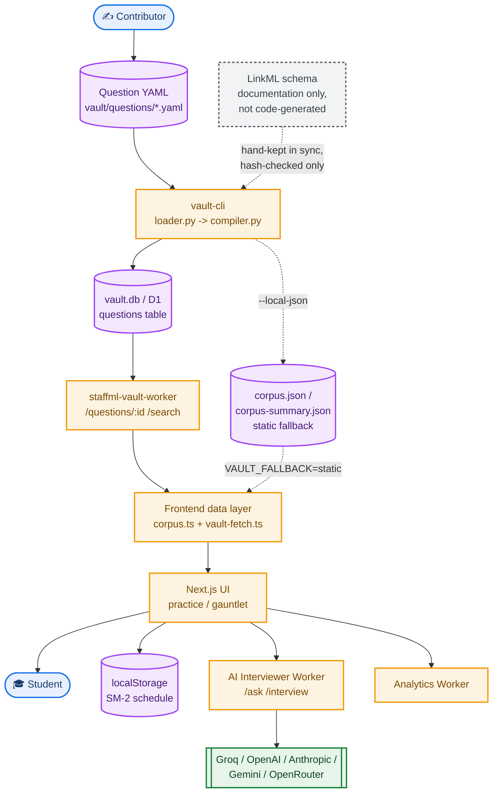

# StaffML: System Design

*This document describes how a question moves from a contributor's YAML file to a student's screen, and how a practice session moves from a click to an updated spaced-repetition schedule. It is written for a contributor changing the vault pipeline, the Workers backend, or the frontend data layer, not for a student using the app. Read [`design.md`](design.md) first for the product framing; this document only covers mechanics. All facts below are sourced from `interviews/staffml/`, `interviews/vault-cli/`, `interviews/vault/`, and `interviews/staffml-vault-worker/`.*

## 1. Problem this system solves

The app has to work with zero backend at all (a bundled summary of every question, browsable and searchable client-side) and also work better with a backend present (full question detail, server-side full-text search, an AI interviewer). Neither mode can be allowed to break the other. A contributor authoring a question also has to have that question reach three independent representations, a Python validation model, a SQL table, and a TypeScript type, without those three drifting out of sync with each other over time. This document covers how both of those problems are actually solved in the current code, including the parts that are not fully solved yet.

## 2. Dependencies and what each one actually does here

| Area | Dependency | Role |
|---|---|---|
| Frontend | `next` ^16.2.11 | App Router, routing, the static export build. |
| Frontend | `react`/`react-dom` ^19 | Every page and component. |
| Frontend | `sigma` / `graphology` / `@react-sigma/core` | Renders the topic-graph visualization. |
| Frontend | `katex` | Math rendering inside question scenarios. |
| Frontend | `js-quantities` | Unit parsing for napkin-math grading, converts compatible units before comparing a student's numeric answer. |
| Frontend | none for HTTP | There is deliberately no HTTP client library. Every worker call goes through a hand-written `fetch` wrapper in `src/lib/vault-fetch.ts`, not axios or a similar dependency. |
| vault-cli | `typer` | The `vault` CLI framework itself. |
| vault-cli | `pydantic>=2.7` | Validates every question YAML file against a schema before it can enter a build. |
| vault-cli | `pyyaml` | Reads and writes the question YAML files. |
| vault-cli | **not** `linkml` | Worth stating explicitly: the LinkML schema exists as documentation, but `linkml` is not an actual dependency of vault-cli, and nothing in the pipeline generates code from it yet. See section 7. |
| staffml-vault-worker | none at runtime | Raw Cloudflare Workers code against D1 (SQL) and KV (rate-limit counters), no npm runtime dependencies at all. |
| AI interviewer worker | none at runtime | Same pattern, a single-file adapter over Cloudflare Workers AI, Groq, OpenAI, Anthropic, Gemini, and OpenRouter, plus a KV-backed rate limiter. |

## 3. Full system diagram



Orange boxes are code that runs, either on Cloudflare or in the browser. Purple cylinders are where data actually lives. Green is the external LLM layer, outside this codebase's control. The dashed gray box is the LinkML schema, present in the picture because it is documented as the source of truth, drawn with a dashed line specifically because it does not actually generate anything downstream of it yet, see section 7.

## 4. Component inventory

```
        interviews/vault/questions/*.yaml
                     |
              vault-cli pipeline
        (loader.py -> compiler.py -> vault.db)
                     |
         +-----------+-----------+
         |                       |
   staffml-vault-worker    corpus.json / corpus-summary.json
   (D1-backed, serves           (bundled or fetched
    /questions/:id,               static fallback)
    /search)                       |
         |                       |
         +-----------+-----------+
                     |
         Frontend data layer (corpus.ts, vault-fetch.ts,
         vault-config.ts, corpus-provider.tsx)
                     |
         Progress tracking (progress.ts, localStorage,
         SM-2 spaced repetition)
```

Two more components sit alongside this main pipeline rather than inside it: the **AI interviewer worker**, a separate Cloudflare Worker with its own rate limiter and its own set of LLM provider adapters, and the **analytics worker**, the simplest of the three, storing batched event data in KV. As of PR #1945 (2026-08-10) there is a third: a **service worker app-shell layer**, covered in section 8a, that makes the whole frontend installable and partially usable offline.

## 5. Data flow

### From a contributor's YAML file to a rendered question

```
1. Contributor writes interviews/vault/questions/<track>-<slug>.yaml
                    |
2. vault build
   loader.py: load_all() walks every YAML file, validates each
   against the Pydantic Question model
   (a file that fails validation is recorded as a LoadError
    and the build continues past it, it does not abort the
    whole build over one bad file)
                    |
3. compiler.py: build()
   writes rows into a local SQLite vault.db, matching the same
   schema as the production D1 table
                    |
4. D1 is populated from this build at deploy time
                    |
5. staffml-vault-worker serves GET /questions/:id
   reads the D1 row and returns it FLAT: fields like
   common_mistake and realistic_solution sit at the top level,
   not nested under a details object
                    |
6. Frontend: corpus.ts's getQuestionFullDetail(id)
   fetches that flat row and explicitly RE-NESTS it into the
   shape the rest of the site expects (Question.details.*)
                    |
7. Rendered in /practice, /gauntlet, or wherever the question
   is opened
```

The re-nesting step in stage 6 is not incidental, it is the join point between what the Worker's storage layer is shaped like and what the frontend's type system expects, and it is one of the more fragile joints in the system precisely because that mapping lives in application code rather than in a schema both sides agree on.

There is a second path that bypasses the Worker entirely: `vault build --local-json` emits `corpus.json` (full detail) and `corpus-summary.json` (bundled, lightweight) directly into the frontend's `src/data/` and `public/data/` directories. If `NEXT_PUBLIC_VAULT_FALLBACK=static` is set, the frontend reads from this static file instead of ever calling the Worker. This is the mechanism that lets local development work with zero network calls.

### From a practice interaction to an updated schedule

```
1. User reveals an answer and self-rates it in /practice
                    |
2. handleScore(score)
                    |
3. saveAttempt({questionId, competencyArea, track, level,
                selfScore, timestamp})
   appended to a localStorage array, capped at 5000 entries
                    |
4. updateSRCard(questionId, finalScore)
   maps the 0-3 self-score to SM-2's 0-5 quality scale,
   updates easeFactor (floored at 1.3), interval, and
   repetitions using the standard SM-2 formula
                    |
5. nextReview = now + interval * one day, persisted to
   localStorage as a Record<string, SRCard>
                    |
6. Later: getDueQuestionIds filters on nextReview <= now
   to build the next practice queue
```

None of this touches the network. The spaced-repetition system is entirely local, by design, matching the product's stated no-account, no-server-side-persistence stance.

## 6. Error handling

The transport layer (`vault-fetch.ts`) is the most carefully built error-handling code in the frontend. Each request gets an 8-second per-attempt timeout, up to two retries with full-jitter exponential backoff, and retries are restricted to a specific set of retryable conditions, HTTP 408, 425, 429, 500, 502, 503, 504, or a network-level error, explicitly excluding a client-initiated abort. Layered on top of that is a per-origin circuit breaker: after five consecutive failures it opens for 30 seconds, and its half-open state correctly admits only one probe request at a time rather than letting every waiting caller through at once, a bug that existed in an earlier, since-replaced version of this transport code.

Rate limiting takes two deliberately different failure postures depending on what is being protected, and the difference is documented directly in the code rather than being an inconsistency:

```
Vault Worker (question data):
  KV unbound     -> fails OPEN  (browsing still works)
  IP header gone -> fails CLOSED (anti-spoofing)

AI interviewer Worker (LLM calls):
  KV unbound     -> fails CLOSED, HTTP 503, reason "limiter_unavailable"
                    explicitly to prevent unbounded LLM spend
```

This asymmetry is intentional: losing the ability to rate-limit question browsing is a minor availability problem, losing the ability to rate-limit LLM calls is a real cost and abuse problem, so the two Workers are allowed to disagree about what "safe" means in the absence of their rate limiter.

Content validation follows the same non-aborting philosophy as the retry logic: a bad question file produces a `LoadError` with its path and message, the build continues past it, and the build only fails outright if zero questions loaded at all. This means a single contributor's malformed YAML cannot block everyone else's build, at the cost of a bad file being able to silently sit unpublished until someone notices it in the error log.

## 7. Where the system is not as connected as it looks

The LinkML schema at `interviews/vault/schema/question_schema.yaml` is described in the design documentation as the single source of truth, but as of this document, it is not the source anything is actually generated from. The vault-cli's own codegen command docstring states plainly that this is a deliberate Phase 1 stub: the three real artifacts a question's shape depends on, the Pydantic models, the D1 schema SQL, and the TypeScript types, are hand-maintained files, kept in sync only by a SHA-256 hash-drift check (`vault codegen --check`) run against a committed hash manifest. If a contributor edits one of these three files and forgets to update the hash, or edits the LinkML schema and forgets all three, the drift check is the only thing that would catch it, and it only catches drift, it cannot fix it or tell you which file is the one that changed incorrectly.

The decision of whether the frontend talks to the Worker or to bundled static data is centralized in one place, `vault-config.ts`'s `getVaultMode()`, which returns `"static"` only when an environment variable is explicitly set that way, and `"worker"` otherwise. This replaced an earlier version of the code where this decision was made independently, and inconsistently, in two different files. Any new code that needs to know which mode is active should call this function rather than re-deriving the answer, that duplication is exactly what caused the earlier bug.

## 8. The service worker and offline/PWA layer

StaffML became an installable Progressive Web App in PR #1945 (2026-08-10), a natural fit given the app already runs 100% client-side. No new npm dependency was added for this, `manifest.ts` and the service worker are hand-written, matching the project's existing preference for zero-dependency infrastructure code (see the "no HTTP client library" line in section 2).

**`src/app/manifest.ts`** is a Next.js manifest route, built `force-static` so it still works with `output: export`. `start_url`, `scope`, `id`, and every icon URL carry `NEXT_PUBLIC_BASE_PATH` explicitly, the same convention `layout.tsx` already used for its og-image URLs, so the manifest resolves correctly regardless of what path prefix the site is deployed under.

**`public/sw.js`** is the more consequential piece, because StaffML already had a service worker (the vault-API response cache, see section 6's rate-limiting discussion for the Worker side of that relationship). PR #1945 appends a second, clearly-delimited app-shell section below the existing vault section rather than replacing or merging into it, and the two are kept structurally incapable of interfering with each other:

- The **vault handler** exits early unless the request URL starts with the vault API's own origin (cross-origin from the app shell's perspective).
- The **app-shell handler** exits early unless the request is same-origin *and* inside the service worker's registration scope, so the surrounding Quarto book's own assets, served from the same domain, are never touched by StaffML's cache.
- Cache key prefixes are disjoint by construction: `staffml-app-` for the shell, `staffml-vault-` for the existing vault cache, so each section's pruning logic (release-keyed for vault, version-keyed for the app shell) can never evict the other's entries.

Caching strategy differs by request type: **navigations use network-first** (a new deploy is visible immediately; the cache only serves a revisit made while offline, falling back to an inline branded offline page as a last resort), while **script/style/image/font requests use stale-while-revalidate** with a 300-entry cap (`_next/static/*` assets are content-hashed, so staleness there is a structural non-issue). Everything else, corpus JSON, any XHR/fetch data, passes through untouched, data freshness for that layer stays owned by the existing vault section and `VersionDriftToast`, not duplicated into the new cache.

`corpus-provider.tsx` registers the service worker unconditionally as part of this change, previously registration may have been more conditional; check that file directly if you need the exact current trigger.

## 9. Contributing

If you are changing the question schema, know that editing the LinkML file alone does nothing, you have to separately update the Pydantic model, the D1 schema SQL, and the TypeScript type by hand, then update the codegen hash, or `vault codegen --check` will correctly flag your change as drift. If you are touching the Worker response shape, check `corpus.ts`'s re-nesting logic in the same change, since the flat-to-nested mapping is not automatically kept in sync with what the Worker actually returns.
