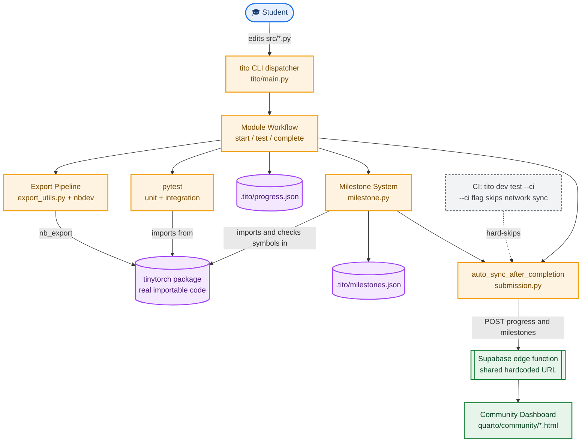

# TinyTorch: System Design

*This document describes how the `tito` CLI and the TinyTorch course pipeline actually work: what happens between a student editing a module and that module becoming a real, importable, gradable piece of the `tinytorch` package. It is written for a contributor who needs to change the export pipeline, the milestone system, or the progress-sync path, not for a student. Read [`design.md`](design.md) first for the pedagogical framing; this document only covers mechanics. All facts below are sourced from `tito/` source, `pyproject.toml`, and `.github/workflows/tinytorch-validate-dev.yml`.*

## 1. Problem this system solves

A student's work has to move through three representations before it counts as complete: a notebook they edit interactively, a plain Python module the test suite and export tooling can process programmatically, and finally a real symbol inside the installed `tinytorch` package that later modules and milestones can import. Each of those representations has to stay consistent with the other two, and a student needs a single command that handles the whole conversion without them ever touching `nbdev` or `jupytext` directly. `tito` is that command.

## 2. Dependencies and what each one actually does here

| Dependency | Role in this codebase |
|---|---|
| `numpy>=2.2.6,<3.0.0` | The tensor backend. `tinytorch/core/tensor.py` wraps numpy arrays directly, this is the actual math, not a convenience layer. |
| `rich>=15.0.0` | All CLI console output. `tito/core/console.py` builds every panel, table, and progress indicator a student sees. |
| `PyYAML>=6.0.3` | Parses milestone configuration. `tito/commands/milestone.py` loads `milestones/milestones.yml` and the per-era `milestone.yml` files with `yaml.safe_load`. |
| `certifi>=2026.4.22` | Supplies the CA bundle for the HTTPS connection `tito` makes when syncing progress to the community backend. |
| `pytest>=8.0.0` | Runs as a subprocess for module-level and integration tests, and is the underlying runner CI drives through `tito dev test`. |
| `nbdev>=3.0.15,<3.0.16` (dev group) | Does the actual export: turns notebook cells into real files inside the `tinytorch/` package. Called in-process via `nbdev.export.nb_export`, not as a subprocess. |
| `jupytext>=1.19.3` (dev group) | Converts a module's plain-Python dev file into the `.ipynb` a student opens in Jupyter, run as a subprocess. |

One dependency direction is worth stating precisely: `tito` depends on the `tinytorch/` project tree (reads and writes `src/`, `modules/`, `milestones/*.yml`, `.tito/progress.json`) and, in exactly one place, imports the generated `tinytorch` package itself to confirm an export actually produced a real, working symbol rather than an empty file. The `tinytorch` package has no dependency on `tito` at all. It is a plain importable library once exported.

## 3. Full system diagram



Orange boxes are code the CLI runs directly. Purple cylinders are things written to disk or to the generated package. Green boxes are the external, independently-maintained systems the CLI only talks to over HTTP. The dashed line is the one path CI deliberately disables.

## 4. Component inventory

```
                              tito (console script)
                                     |
                        tito/main.py: TinyTorchCLI
                     dict-based command registry, one
                     BaseCommand subclass per subcommand
                                     |
        +---------------+-----------+-----------+-----------------+
        |               |           |           |                 |
  Module workflow   Milestone    Community    Dev/CI tools    Package/NBGrader
  (start/test/       system      (login/sync)  (test --ci)     commands
   complete/reset)
        |
        v
  export_utils.py (shared: discover_modules, convert_py_to_notebook,
                    validate_notebook_integrity)
```

The five components that matter most for a system-design understanding:

- **The `tito` dispatcher** (`tito/main.py`). A literal dict maps subcommand strings to command classes. There is no plugin discovery mechanism, adding a command means adding an entry to this dict.
- **The module workflow subsystem** (`tito/commands/module/workflow.py`, close to 1900 lines). Owns the full lifecycle of one module: `start`, `view`, `resume`, `test`, `complete`, `reset`.
- **The export pipeline** (`tito/commands/export_utils.py`), shared logic the module workflow calls into rather than owning itself.
- **The milestone system** (`tito/commands/milestone.py`), which both gates on completed modules and independently triggers progress sync.
- **The progress-sync and community dashboard pair** (`tito/core/submission.py` and `tinytorch/quarto/community/`), two separate codebases (Python CLI, static JS site) that agree on nothing except a shared, hardcoded backend URL.

## 5. Data flow: from a student's edit to a real symbol

```
1. Student edits src/XX_module/XX_module.py
   (percent-format Python, #| export / #| default_exp directives)
                    |
2. tito module complete NN
                    |
3. _run_inline_unit_tests
   subprocess: python <dev_file>.py
                    |
4. _check_notebook_syntax
   validates the notebook before export proceeds
                    |
5. export_module(module_name)
   reads modules/<module>/<name>.ipynb
   nb_export(notebook, lib_path=tinytorch/)
   -> writes a real file, e.g. tinytorch/core/tensor.py
                    |
6. _run_integration_tests
   pytest against tests/XX_module/test_XX_module_progressive.py
   importing from the tinytorch package just written
                    |
7. update_progress(module_num, module_name)
   writes .tito/progress.json
                    |
8. _check_milestone_unlocks
   may write .tito/milestones.json
                    |
9. _trigger_submission -> auto_sync_after_completion
   POSTs progress + milestones JSON to the Supabase backend
                    |
10. Community dashboard (separate static site) reads the same
    backend and shows the student's progress
```

Two steps are easy to miss and worth calling out directly. First, `tito module test <NN>` alone does not run step 5, only `tito module complete <NN>` exports anything, a common point of confusion for a student who assumes testing and completing are the same action. Second, step 8's milestone check does not just look at whether the export step reported success, it separately imports the just-exported module and checks that specific required symbols actually exist, since a file existing and a file containing working code are not the same guarantee.

## 6. Error handling

```
TinyTorchCLIError (base)
    |
    +-- ValidationError
    +-- ExecutionError
    +-- EnvironmentError
    +-- ModuleNotFoundError
```

The top-level `run()` loop catches `KeyboardInterrupt` (exits 130), catches `TinyTorchCLIError` and its subclasses for a clean, formatted error panel, and catches bare `Exception` as a last resort, logged as an unexpected error rather than surfaced as a normal CLI failure. This distinction matters for debugging: a `TinyTorchCLIError` is a condition the code anticipated and has a good message for, a bare exception is something nobody planned for.

The export pipeline itself does not raise on most failures, it returns structured results instead. `validate_notebook_integrity` returns a dict with `valid`, `issues`, `warnings`, and `stats` rather than throwing, and `export_module` catches both a missing-nbdev `ImportError` (with a specific "run `pip install nbdev`" message) and any other exception, returning an integer status rather than propagating.

The progress-sync path has its own deliberate, non-exception-based error model. `SyncResult` is a dataclass with two independent booleans: `ok`, meaning the server confirmed the write actually persisted, and `accepted`, meaning the server returned success but persistence is unconfirmed. This distinction exists because of a real, previously shipped bug where a 2xx HTTP response with a null or zero synced-module count was reported to the student as a successful sync when nothing had actually synced. `sync_progress` also separates a 401 (attempts a token refresh) from other HTTP errors, from a network-level `URLError`, from a plain timeout, each handled differently rather than collapsed into one generic failure message.

## 7. How the pieces connect

```
export + milestone completion
        |
        +---> auto_sync_after_completion (one shared function,
        |      called from both module completion and milestone
        |      completion, not duplicated per call site)
        |
        v
Supabase edge function URL
(hardcoded identically in tito/core/submission.py
 and tinytorch/quarto/community/modules/config.js)
        |
        v
Community dashboard (separate static site, separate
JS codebase, no shared type or schema file with the CLI)
```

The CLI and the dashboard are two independently maintained codebases that agree with each other only through a hardcoded URL string appearing in both places. There is no shared schema file, no generated client, nothing that would cause a compile-time or CI-time failure if one side changed its payload shape without the other side changing to match. This is worth knowing before touching either side: a change to what `assemble_payload` sends has to be verified against the dashboard's actual JS by hand, not by any automated check.

Separately, CI does not go through the same code path a student's local `tito module complete` uses. CI calls `tito dev test` with an explicit `--ci` flag, and that flag is checked directly inside the sync logic to hard-skip any network call during a CI run. This means a bug in the sync path specifically can pass CI cleanly while still being broken for a real student, since CI never actually exercises that code.

## 8. Known coupling worth understanding before you change anything

The module registry (`tito/core/modules.py`) is the single place that maps a module number to a module name, and it is read by the export pipeline, the milestone system's required-modules check, and (per the module docstrings) grading tooling. A change to module numbering has to go through this one file, not be patched independently in each consumer.

The milestone unlock check is not a passive read of the progress file. It actively imports the freshly exported module and checks named attributes exist, which means a milestone can correctly report a module as "exported but not actually working" rather than trusting file existence alone. Any refactor of the export pipeline that changes where a symbol lands needs to be checked against this specific validation, not just against the export step's own success/failure return value.

## 9. Contributing

If you are changing the export pipeline, run the full chain by hand at least once, edit a real module's dev file, run `tito module complete`, and confirm the resulting file in `tinytorch/` both exists and contains the symbols the milestone system expects. A passing `test_static.py`-equivalent check is not sufficient proof the export actually worked end to end. If you are touching the progress-sync path, remember CI never exercises it, you need to test it manually against a real (or staging) backend, not rely on a green CI run as evidence it still works.
